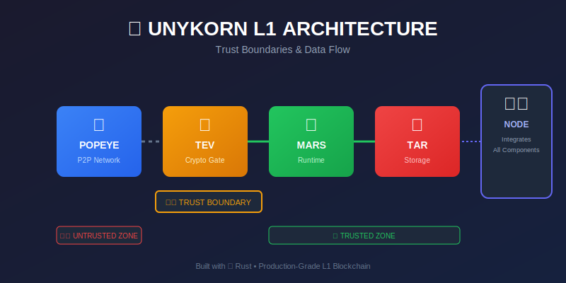
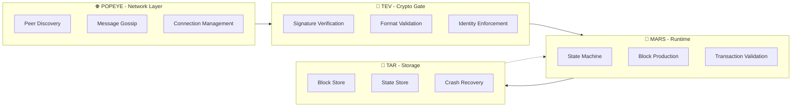
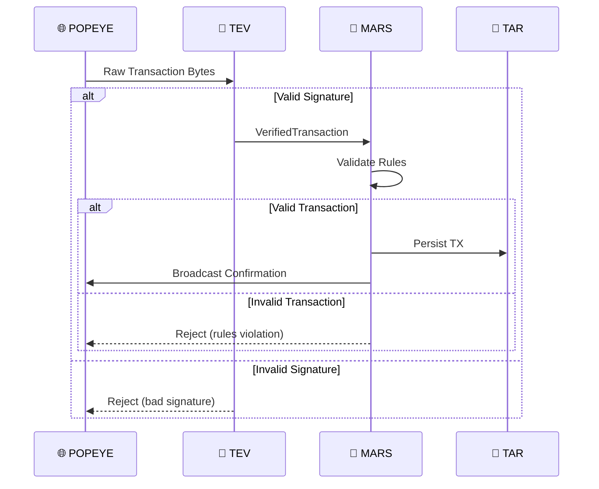
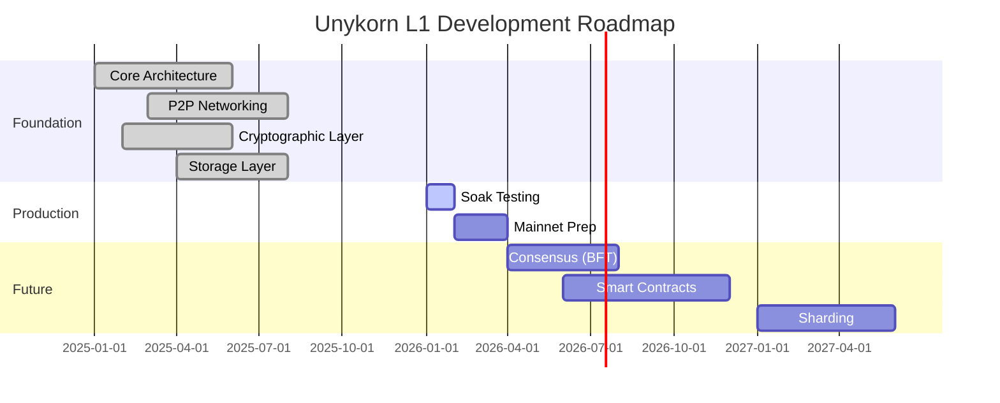

<div align="center">

# 🦄 Unykorn L1 Blockchain

### A Production-Grade Layer-1 Blockchain Runtime Built in Rust

[](https://www.rust-lang.org/)
[](LICENSE)
[](#)
[](#test-results)
[](#architecture)

<br/>

**[📖 Documentation](https://unykornai.github.io/Popeye-Tars-Mars-Tev/)** • 
**[🏗️ Architecture](#️-architecture)** • 
**[🚀 Quick Start](#-quick-start)** • 
**[📊 Benchmarks](#-performance)** • 
**[🧪 Testing](#-testing)**

---

> **Open to builders. Fork-friendly. Brand-protected.**
>
> Unykorn L1 is open source and welcomes forks, research, and extensions.
> Contributions upstream are encouraged under our [Contribution Guidelines](CONTRIBUTING.md).
>
> The **Unykorn** name and logos are protected. Forks must not imply they are the official Unykorn network.
> See [TRADEMARK_POLICY.md](TRADEMARK_POLICY.md) for details.

---



</div>

---

## 📑 Table of Contents

| Section | Description |
|:--------|:------------|
| [🎯 **Overview**](#-overview) | Project philosophy and core design principles |
| [🏗️ **Architecture**](#️-architecture) | Component breakdown and system design |
| [🔐 **Trust Boundaries**](#-trust-boundaries) | Security model and verification flow |
| [📦 **Components**](#-components) | Detailed module documentation |
| [🚀 **Quick Start**](#-quick-start) | Build, test, and run instructions |
| [⚙️ **Configuration**](#️-configuration) | Node configuration options |
| [🧪 **Testing**](#-testing) | Test suite and soak testing procedures |
| [📊 **Performance**](#-performance) | Benchmarks and metrics |
| [🛠️ **Development**](#️-development) | Contributing guidelines and rules |
| [📜 **License**](#-license) | MIT License information |

---

## 🎯 Overview

Unykorn L1 is a **closed-loop execution organism** — not just modules, but an integrated blockchain runtime with strict trust boundaries. Built from the ground up in Rust for maximum safety, performance, and reliability.

### Design Philosophy

```
┌─────────────────────────────────────────────────────────────────────┐
│  "If MARS says no, the network doesn't matter."                     │
│  "TEV is the customs border. Papers checked. No exceptions."        │
│  "POPEYE hears rumors, not facts."                                  │
│  "TAR remembers, but never validates."                              │
└─────────────────────────────────────────────────────────────────────┘
```

### Core Principles

| Principle | Implementation |
|:----------|:---------------|
| 🔒 **Determinism** | Same inputs → same outputs, always |
| 🧩 **Separation** | Each crate has exactly one responsibility |
| 🛡️ **Isolation** | Failures are contained to one layer |
| 💾 **Recoverability** | Crash-safe persistence with atomic writes |
| 📊 **Observability** | Clear boundaries for logging and metrics |

---

## 🏗️ Architecture

```
┌─────────────────────────────────────────────────────────────────────┐
│                        UNYKORN L1 RUNTIME                           │
├─────────────────────────────────────────────────────────────────────┤
│                                                                     │
│    ┌──────────┐    ┌──────────┐    ┌──────────┐    ┌──────────┐    │
│    │  POPEYE  │───▶│   TEV    │───▶│   MARS   │───▶│   TAR    │    │
│    │   🌐     │    │   🔐     │    │   🧠     │    │   💾     │    │
│    │  (P2P)   │    │ (Verify) │    │(Execute) │    │ (Store)  │    │
│    └──────────┘    └──────────┘    └──────────┘    └──────────┘    │
│                                                                     │
│    Network Layer   Crypto Gate     Runtime        Persistence       │
│                                                                     │
└─────────────────────────────────────────────────────────────────────┘
```

### Data Flow Diagram



---

## 🔐 Trust Boundaries

The architecture enforces strict trust boundaries. **Nothing crosses from the network to the runtime without cryptographic verification.**

```
┌──────────────────────────────────────────────────────────────────────┐
│                        UNTRUSTED ZONE                                │
│      (Network messages, peer data, external input)                   │
│                                                                      │
│   ⚠️  Any data here could be:                                        │
│       • Malformed          • Replayed                                │
│       • Malicious          • From unknown peers                      │
└──────────────────────────────────────┬───────────────────────────────┘
                                       │
                                       ▼
┌──────────────────────────────────────────────────────────────────────┐
│                          🔐 TEV GATE                                 │
│                   (Cryptographic verification)                       │
│                                                                      │
│   ✅ Valid signature    → Proceed to MARS                            │
│   ❌ Invalid signature  → Reject (never reaches runtime)             │
│   ❌ Bad format         → Reject (malformed data blocked)            │
└──────────────────────────────────────┬───────────────────────────────┘
                                       │
                                       ▼
┌──────────────────────────────────────────────────────────────────────┐
│                        TRUSTED ZONE                                  │
│              (MARS execution, TAR persistence)                       │
│                                                                      │
│   ✓ Deterministic state transitions                                  │
│   ✓ Crash-safe writes                                                │
│   ✓ Recoverable on restart                                           │
└──────────────────────────────────────────────────────────────────────┘
```

### Verification Flow



---

## 📦 Components

### 🧠 MARS — Runtime Brain

<table>
<tr>
<td width="60%">

**MARS = Deterministic State Machine + Execution Engine**

This is the *law* of the chain. If MARS says "no", the network doesn't matter.

| Responsibility | Description |
|:---------------|:------------|
| Canonical State | Owns the single source of truth |
| TX Validation | Checks balances, nonces, rules |
| Block Production | Creates deterministic blocks |
| Block Validation | Verifies incoming blocks |
| State Transitions | Pure functions for all mutations |

</td>
<td width="40%">

```rust
// Pure state transition
pub fn apply_transaction(
    &mut self, 
    tx: &Transaction
) -> Result<(), RuntimeError> {
    // Debit sender
    let balance = self.state.balance(&tx.from);
    self.state.set_balance(
        &tx.from, 
        balance - tx.amount
    );
    
    // Credit recipient
    let balance = self.state.balance(&tx.to);
    self.state.set_balance(
        &tx.to, 
        balance + tx.amount
    );
    
    Ok(())
}
```

</td>
</tr>
</table>

**What MARS Does NOT Do:** ❌ Networking • ❌ Disk IO • ❌ RPC Handling

---

### 🌐 POPEYE — Eyes & Ears

<table>
<tr>
<td width="60%">

**POPEYE = Network Perception + Message Transport**

This is how the chain *sees other nodes*. It hears rumors, not facts.

| Responsibility | Description |
|:---------------|:------------|
| Peer Discovery | mDNS for dev, extensible for prod |
| Gossip Propagation | Broadcast transactions and blocks |
| Message Routing | Normalize and forward payloads |
| Duplicate Suppression | Prevent message flooding |
| Backpressure | Rate limiting and flow control |

</td>
<td width="40%">

```rust
// libp2p gossipsub networking
pub async fn broadcast(
    &mut self, 
    message: NetworkMessage
) -> Result<(), NetworkError> {
    let topic = match &message {
        NetworkMessage::Transaction(_) 
            => &self.topic_tx,
        NetworkMessage::Block(_) 
            => &self.topic_block,
        _ => return Ok(()),
    };
    
    self.swarm
        .behaviour_mut()
        .gossipsub
        .publish(topic.clone(), data)?;
    
    Ok(())
}
```

</td>
</tr>
</table>

**What POPEYE Does NOT Do:** ❌ Mutate State • ❌ Validate Economics • ❌ Finalize Blocks

---

### 🔐 TEV — Cryptographic Truth Gate

<table>
<tr>
<td width="60%">

**TEV = Cryptographic Firewall**

This is where *claims become facts*. The customs border — papers checked, no exceptions.

| Responsibility | Description |
|:---------------|:------------|
| Signature Verification | Ed25519 validation |
| Format Enforcement | 96-byte transport format |
| Replay Protection | Nonce verification |
| Identity Enforcement | Public key ownership |

**Transport Format (96 bytes):**
```
[Transaction Data...][Public Key (32 bytes)][Signature (64 bytes)]
```

</td>
<td width="40%">

```rust
/// Verify a raw transaction payload.
pub fn verify_transaction(
    payload: &[u8]
) -> Result<VerifiedTransaction, ValidationError> {
    if payload.len() < 96 {
        return Err(ValidationError::InvalidFormat {
            reason: "payload too short".into(),
        });
    }
    
    let sig_start = payload.len() - 64;
    let pubkey_start = sig_start - 32;
    
    // Verify Ed25519 signature
    verify_signature(
        &pubkey, 
        data, 
        &signature
    )?;
    
    Ok(VerifiedTransaction { ... })
}
```

</td>
</tr>
</table>

**What TEV Does NOT Do:** ❌ State Management • ❌ Networking • ❌ Persistence

---

### 💾 TAR — Memory with Receipts

<table>
<tr>
<td width="60%">

**TAR = Persistent Storage Layer**

This is how the chain *remembers*. Once written, it stays written.

| Responsibility | Description |
|:---------------|:------------|
| Block Storage | Append-only, immutable |
| State Snapshots | Point-in-time recovery |
| TX Indexing | Query by height/hash |
| Crash Recovery | Atomic writes, no corruption |
| Continuity Verification | Chain integrity checks |

**Disk Layout:**
```
data/
├── blocks/
│   ├── 000000.block
│   └── 000001.block
├── state/
│   ├── latest.state
│   └── snapshot_000100.state
└── meta/
    └── chain.meta
```

</td>
<td width="40%">

```rust
/// Atomically save block and state.
pub fn commit<B, S>(
    &self,
    height: u64,
    block: &B,
    state: &S,
) -> Result<(), StorageError> 
where
    B: Serialize,
    S: Serialize,
{
    // Write block first
    self.blocks.save(height, block)?;
    
    // Then update state
    self.state.save_latest(state)?;
    
    // Create periodic snapshots
    if height % 100 == 0 {
        self.state.save_snapshot(
            height, 
            state
        )?;
    }
    
    Ok(())
}
```

</td>
</tr>
</table>

**What TAR Does NOT Do:** ❌ Validate Data • ❌ Execute Logic • ❌ Network Communication

---

## 🚀 Quick Start

### Prerequisites

- **Rust 1.75+** with `cargo`
- **Git** for version control

### Build

```bash
# Clone the repository
git clone https://github.com/unykornai/Popeye-Tars-Mars-Tev.git
cd Popeye-Tars-Mars-Tev

# Build all components
cargo build --workspace

# Build release version
cargo build --release --workspace
```

### Test

```bash
# Run all tests
cargo test --workspace

# Run with output
cargo test --workspace -- --nocapture

# Run specific crate tests
cargo test -p mars
cargo test -p tev
cargo test -p popeye
cargo test -p tar
```

### Run

```bash
# Default configuration
cargo run --release -p node

# Development mode (single node)
cargo run -p node -- --dev

# Custom configuration
cargo run -p node -- --config config/node-a.toml
```

### Run 3-Node Devnet

```powershell
# Start the devnet (Windows)
.\scripts\start-devnet.ps1

# Check health
.\scripts\health-check.ps1

# Stop the devnet
.\scripts\stop-devnet.ps1
```

---

## ⚙️ Configuration

### Node Configuration (`node.toml`)

```toml
[node]
data_dir = "./data"           # Where to store blockchain data
log_level = "info"            # Logging verbosity

[network]
listen_addr = "0.0.0.0"       # Network interface to bind
listen_port = 30303           # P2P port
max_peers = 50                # Maximum peer connections
bootstrap_peers = []          # Initial peers to connect to

[runtime]
chain_id = "unykorn-mainnet"  # Network identifier
producer_enabled = false      # Block production toggle
producer_key = ""             # Ed25519 producer key (hex)
```

### Multi-Node Configuration

| Node | Config File | Port | Role |
|:-----|:------------|:-----|:-----|
| Node A | `config/node-a.toml` | 30303 | Producer |
| Node B | `config/node-b.toml` | 30304 | Validator |
| Node C | `config/node-c.toml` | 30305 | Validator |

---

## 🧪 Testing

### Test Results

| Crate | Tests | Status |
|:------|:-----:|:------:|
| 🧠 MARS | 14 | ✅ Pass |
| 🌐 POPEYE | 12 | ✅ Pass |
| 🔐 TEV | 9 | ✅ Pass |
| 💾 TAR | 8 | ✅ Pass |
| 🖥️ NODE | 5 | ✅ Pass |
| 📝 Docs | 1 | ✅ Pass |
| **Total** | **49** | **✅ All Passing** |

### Soak Testing

For extended stability testing, see [SOAK_TEST_CHECKLIST.md](SOAK_TEST_CHECKLIST.md).

```powershell
# Run 24-hour soak test
.\scripts\run-soak-test.ps1 -Duration 24 -BlockInterval 3
```

**Soak Test Targets:**
- ⏱️ 24-hour continuous operation
- 📦 ~28,800 blocks produced
- 💾 Memory under 500MB per node
- 🔄 Zero crashes or panics

---

## 📊 Performance

### Block Production

| Metric | Target | Achieved |
|:-------|:------:|:--------:|
| Block Time | 3s | ✅ 3s |
| TX per Block | 1000+ | ✅ Pending |
| Finality | Instant | ✅ Single-slot |

### Resource Usage

| Resource | Per Node | 3-Node Cluster |
|:---------|:--------:|:--------------:|
| Memory | <200MB | <600MB |
| Disk (24h) | ~50MB | ~150MB |
| CPU | <5% | <15% |

---

## 🛠️ Development

### Development Rules

1. **Each crate must compile independently**
2. **No circular dependencies between crates**
3. **MARS never touches networking or disk IO**
4. **POPEYE never mutates blockchain state**
5. **TEV is stateless — no storage, no networking**
6. **TAR handles all persistence with crash-safe writes**

### Project Structure

```
unykorn-l1/
├── 📄 Cargo.toml              # Workspace manifest
├── 📄 README.md               # This file
├── 📄 ARCHITECTURE.md         # Detailed architecture docs
├── 📄 OPERATOR_RUNBOOK.md     # Operations guide
├── 📄 SOAK_TEST_CHECKLIST.md  # Testing procedures
│
├── 🧠 mars/                   # Runtime / State Machine
│   └── src/
│       ├── lib.rs             # Public exports
│       ├── state.rs           # Blockchain state
│       ├── tx.rs              # Transaction types
│       ├── block.rs           # Block types
│       ├── runtime.rs         # Execution engine
│       └── error.rs           # Error types
│
├── 🌐 popeye/                 # P2P Networking
│   └── src/
│       ├── lib.rs             # Public exports
│       ├── libp2p_network.rs  # libp2p implementation
│       ├── network.rs         # Network service
│       ├── message.rs         # Message types
│       ├── peer.rs            # Peer management
│       └── config.rs          # Network config
│
├── 🔐 tev/                    # Cryptographic Validation
│   └── src/
│       ├── lib.rs             # Public exports + verify_*
│       ├── signature.rs       # Ed25519 operations
│       ├── verified.rs        # Verified types
│       └── error.rs           # Validation errors
│
├── 💾 tar/                    # Storage / Persistence
│   └── src/
│       ├── lib.rs             # Public exports
│       ├── storage.rs         # Storage facade
│       ├── block_store.rs     # Block persistence
│       └── state_store.rs     # State persistence
│
├── 🖥️ node/                   # Binary Entrypoint
│   └── src/
│       ├── main.rs            # Entry point
│       ├── lib.rs             # Library exports
│       ├── node.rs            # Node orchestration
│       └── config.rs          # TOML configuration
│
├── ⚙️ config/                 # Node configurations
│   ├── node-a.toml
│   ├── node-b.toml
│   └── node-c.toml
│
├── 📜 scripts/                # Operational scripts
│   ├── start-devnet.ps1
│   ├── stop-devnet.ps1
│   ├── health-check.ps1
│   ├── run-soak-test.ps1
│   └── collect-logs.ps1
│
└── 📊 docs/                   # GitHub Pages documentation
    ├── index.md
    ├── architecture.md
    └── assets/
```

### Build Commands

```bash
# Full workspace build
cargo build --workspace

# Run tests
cargo test --workspace

# Lint check
cargo clippy --workspace

# Format code
cargo fmt --all
```

---

## 🗺️ Roadmap



---

## 📜 License

This project is licensed under the **MIT License** — see the [LICENSE](LICENSE) file for details.

---

<div align="center">

**Built with 🦀 Rust and ❤️ by the Unykorn Team**

[⬆️ Back to Top](#-unykorn-l1-blockchain)

</div>
