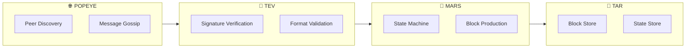
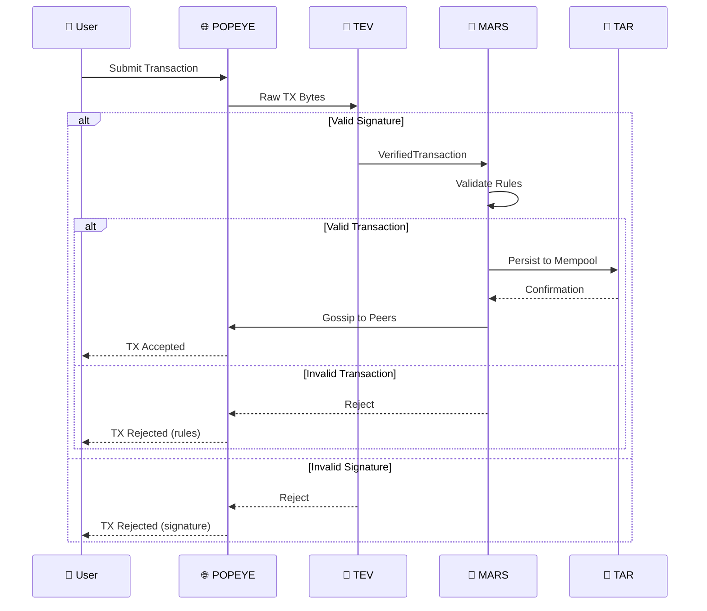
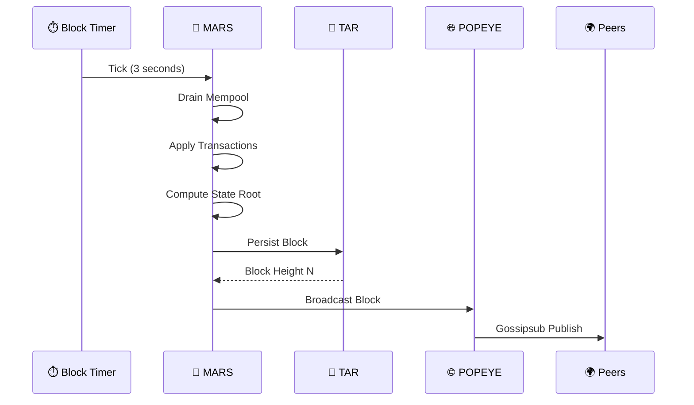

# 🏗️ Architecture
{: .no_toc }

Understanding the Unykorn L1 blockchain architecture and design principles.
{: .fs-6 .fw-300 }

## Table of Contents
{: .no_toc .text-delta }

1. TOC
{:toc}

---

## Overview

Unykorn L1 is a **closed-loop execution organism** — not just modules, but an integrated blockchain runtime with strict trust boundaries.

### The Four Pillars

| Component | Emoji | Role | Philosophy |
|:----------|:-----:|:-----|:-----------|
| **POPEYE** | 🌐 | Network Layer | "Hears rumors, not facts" |
| **TEV** | 🔐 | Crypto Gate | "Papers checked. No exceptions." |
| **MARS** | 🧠 | Runtime | "If MARS says no, the network doesn't matter" |
| **TAR** | 💾 | Storage | "Remembers, but never validates" |

---

## Data Flow



---

## Trust Boundaries

### The Security Model

The architecture enforces strict trust boundaries. **Nothing crosses from the network to the runtime without cryptographic verification.**

```
┌──────────────────────────────────────────────────────────────────────┐
│                        UNTRUSTED ZONE                                │
│      (Network messages, peer data, external input)                   │
└──────────────────────────────────────┬───────────────────────────────┘
                                       │
                                       ▼
┌──────────────────────────────────────────────────────────────────────┐
│                          🔐 TEV GATE                                 │
│                   (Cryptographic verification)                       │
│                                                                      │
│   ✅ Valid signature    → Proceed to MARS                            │
│   ❌ Invalid signature  → Reject (never reaches runtime)             │
└──────────────────────────────────────┬───────────────────────────────┘
                                       │
                                       ▼
┌──────────────────────────────────────────────────────────────────────┐
│                        TRUSTED ZONE                                  │
│              (MARS execution, TAR persistence)                       │
└──────────────────────────────────────────────────────────────────────┘
```

---

## Transaction Lifecycle



---

## Block Production



---

## Component Details

### 🧠 MARS — Runtime Brain

**Responsibilities:**
- ✅ Canonical State - Owns the single source of truth
- ✅ TX Validation - Checks balances, nonces, rules
- ✅ Block Production - Creates deterministic blocks
- ✅ Block Validation - Verifies incoming blocks
- ✅ State Transitions - Pure functions for all mutations

**Restrictions:**
- ❌ No networking code
- ❌ No disk IO
- ❌ No RPC handling

---

### 🌐 POPEYE — Eyes & Ears

**Responsibilities:**
- ✅ Peer Discovery - mDNS for dev, extensible for prod
- ✅ Gossip Propagation - Broadcast transactions and blocks
- ✅ Message Routing - Normalize and forward payloads
- ✅ Duplicate Suppression - Prevent message flooding
- ✅ Backpressure - Rate limiting and flow control

**Restrictions:**
- ❌ Never mutates state
- ❌ Never validates economics
- ❌ Never finalizes blocks

---

### 🔐 TEV — Cryptographic Truth Gate

**Responsibilities:**
- ✅ Signature Verification - Ed25519 validation
- ✅ Format Enforcement - 96-byte transport format
- ✅ Replay Protection - Nonce verification
- ✅ Identity Enforcement - Public key ownership

**Transport Format:**
```
[Transaction Data...][Public Key (32 bytes)][Signature (64 bytes)]
```

**Restrictions:**
- ❌ No state management
- ❌ No networking
- ❌ No persistence

---

### 💾 TAR — Memory with Receipts

**Responsibilities:**
- ✅ Block Storage - Append-only, immutable
- ✅ State Snapshots - Point-in-time recovery
- ✅ TX Indexing - Query by height/hash
- ✅ Crash Recovery - Atomic writes, no corruption
- ✅ Continuity Verification - Chain integrity checks

**Disk Layout:**
```
data/
├── blocks/
│   ├── 000000.block
│   └── 000001.block
├── state/
│   ├── latest.state
│   └── snapshot_000100.state
└── meta/
    └── chain.meta
```

**Restrictions:**
- ❌ Never validates data
- ❌ Never executes logic
- ❌ Never communicates over network

---

## Design Properties

| Property | Implementation |
|:---------|:---------------|
| **Determinism** | Same inputs → same outputs, always |
| **Separation** | Each crate has one job |
| **Fault Isolation** | Failures contained to one layer |
| **Recoverability** | TAR provides crash-safe persistence |
| **Observability** | Clear boundaries for logging/metrics |
| **Extensibility** | Consensus plugs in cleanly |
