# 📦 Components
{: .no_toc }

Detailed documentation for each Unykorn L1 component.
{: .fs-6 .fw-300 }

---

## Component Overview

| Component | Crate | Description |
|:----------|:------|:------------|
| [🧠 MARS](mars.html) | `mars` | Runtime / State Machine |
| [🌐 POPEYE](popeye.html) | `popeye` | P2P Networking |
| [🔐 TEV](tev.html) | `tev` | Cryptographic Validation |
| [💾 TAR](tar.html) | `tar` | Storage / Persistence |
| [🖥️ NODE](node.html) | `node` | Binary Entrypoint |

---

## Dependency Graph

```mermaid
graph TD
    NODE[🖥️ NODE] --> MARS[🧠 MARS]
    NODE --> POPEYE[🌐 POPEYE]
    NODE --> TEV[🔐 TEV]
    NODE --> TAR[💾 TAR]
    
    style NODE fill:#6366f1,stroke:#4f46e5,color:#fff
    style MARS fill:#22c55e,stroke:#16a34a,color:#fff
    style POPEYE fill:#3b82f6,stroke:#2563eb,color:#fff
    style TEV fill:#f59e0b,stroke:#d97706,color:#fff
    style TAR fill:#ef4444,stroke:#dc2626,color:#fff
```



---

## Design Rules

Each component follows strict design rules to maintain separation of concerns:

### ✅ What Each Component DOES

| Component | Responsibilities |
|:----------|:-----------------|
| **MARS** | State transitions, block production, transaction validation |
| **POPEYE** | Peer discovery, message gossip, connection management |
| **TEV** | Signature verification, format validation, identity enforcement |
| **TAR** | Block storage, state persistence, crash recovery |

### ❌ What Each Component Does NOT Do

| Component | Restrictions |
|:----------|:-------------|
| **MARS** | No networking, no disk IO, no RPC |
| **POPEYE** | No state mutation, no validation, no finalization |
| **TEV** | No storage, no networking, no persistence |
| **TAR** | No validation, no execution, no networking |

---

## Build & Test

### Building Individual Components

```bash
# Build specific crate
cargo build -p mars
cargo build -p popeye
cargo build -p tev
cargo build -p tar
cargo build -p node
```

### Testing Individual Components

```bash
# Test specific crate
cargo test -p mars
cargo test -p popeye
cargo test -p tev
cargo test -p tar
cargo test -p node
```

### Running Clippy on Individual Components

```bash
cargo clippy -p mars
cargo clippy -p popeye
cargo clippy -p tev
cargo clippy -p tar
cargo clippy -p node
```
