# 🗺️ Roadmap
{: .no_toc }

Unykorn L1 development timeline and future plans.
{: .fs-6 .fw-300 }

---

## Development Timeline

---

## Phase 1: Foundation ✅

**Status:** Complete

### Delivered

| Component | Description | Status |
|:----------|:------------|:------:|
| 🧠 MARS | Deterministic state machine | ✅ Done |
| 🌐 POPEYE | libp2p networking with gossipsub | ✅ Done |
| 🔐 TEV | Ed25519 cryptographic verification | ✅ Done |
| 💾 TAR | Crash-safe persistence | ✅ Done |
| 🖥️ NODE | Component integration | ✅ Done |

### Milestones

- [x] Block production
- [x] Peer discovery (mDNS)
- [x] Message gossip
- [x] State persistence
- [x] Crash recovery
- [x] 49 passing tests

---

## Phase 2: Production 🚧

**Status:** In Progress

### Current Work

| Task | Description | Status |
|:-----|:------------|:------:|
| Soak Testing | 24-hour stability tests | 🚧 Active |
| Documentation | GitHub Pages site | 🚧 Active |
| Performance | Benchmarking suite | 📋 Planned |
| Monitoring | Metrics dashboard | 📋 Planned |

### Targets

- [ ] 24-hour soak test with zero crashes
- [ ] Memory stable under 500MB per node
- [ ] Block production at 3-second intervals
- [ ] Comprehensive operator runbook

---

## Phase 3: Consensus 📋

**Status:** Planned (Q2 2026)

### Features

| Feature | Description |
|:--------|:------------|
| BFT Consensus | Byzantine fault tolerance |
| Validator Set | Dynamic validator management |
| Finality | Probabilistic → deterministic |
| Voting | Block voting mechanism |

### Architecture Extension

```mermaid
flowchart TB
    subgraph Network
        POPEYE[🌐 POPEYE]
    end
    
    subgraph Verification
        TEV[🔐 TEV]
    end
    
    subgraph Consensus["New: Consensus Layer"]
        VOTE[📊 Voting]
        FINAL[✓ Finality]
    end
    
    subgraph Runtime
        MARS[🧠 MARS]
    end
    
    subgraph Storage
        TAR[💾 TAR]
    end
    
    POPEYE --> TEV
    TEV --> Consensus
    Consensus --> MARS
    MARS --> TAR
```

---

## Phase 4: Smart Contracts 📋

**Status:** Planned (Q3-Q4 2026)

### Features

| Feature | Description |
|:--------|:------------|
| VM Integration | WASM or EVM execution |
| Contract Deployment | Deploy and call contracts |
| Gas Metering | Resource accounting |
| Standard Library | Common contract patterns |

---

## Phase 5: Scaling 📋

**Status:** Planned (2027)

### Features

| Feature | Description |
|:--------|:------------|
| Sharding | Horizontal scaling |
| Cross-shard TX | Inter-shard communication |
| State Pruning | Historical state management |
| Light Clients | SPV-style verification |

---

## Contributing

We welcome contributions! See our [Contributing Guide](https://github.com/unykornai/Popeye-Tars-Mars-Tev/blob/main/CONTRIBUTING.md) for details.

### Priority Areas

1. **Testing** - Additional test coverage
2. **Documentation** - API documentation
3. **Performance** - Optimization opportunities
4. **Security** - Security audits

---

## Version History

| Version | Date | Highlights |
|:--------|:-----|:-----------|
| 0.1.0 | 2026-02 | Initial release with core components |
| 0.2.0 | TBD | Mainnet preparation |
| 0.3.0 | TBD | Consensus integration |
| 1.0.0 | TBD | Production mainnet |
